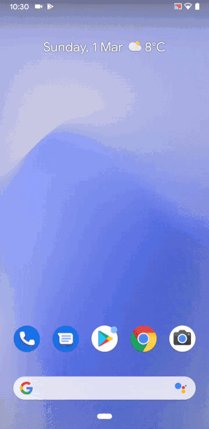

# HsKAopen

HsKAopen ist eine Android-Application, die für eine einfache WLAN-Verbindung für die Hochschule Karlsruhe Technik und Wirtschaft entwickelt wurde.

## Installieren

Sie müssen [Android Studio installieren](https://developer.android.com/studio/install), um die Software auf Ihrem Computer zu benutzen.
In Android Studio kann das Projekt importiert werden (File -> New -> Import Project) und für Test- und Entwicklungszwecke verwendet werden. 

Sie können die App [im Emulator](https://developer.android.com/studio/run/emulator) oder [auf Ihrem Handy](https://developer.android.com/studio/run/device) ausführen. In Windows muss dafür noch ein [passender Treiber installiert werden](https://developer.android.com/studio/run/oem-usb). 

## Verwendung

Die HsKAopen Application ermöglicht es die MAC-Adresse des Handys an den Server der Hochschule zu senden, um die WLAN-Verbindung mit Internetdiensten außerhalb des Hochschulnetzes ohne Proxy einzurichten. 

Der Benutzer muss seinen IZ-Benutzername und sein IZ-Passwort eingeben, um die MAC-Adresse zu senden. 

In der Applikation werden auch konkrete Schritte für die HsKAopen unter dem Abschnitt "App requirements" beschrieben, um für Benutzer klar zu machen, was die Applikation macht. 

In diesem Abschnitt wird auch beschrieben, wie der Benutzer die fehlgeschlagene Verbindung reparieren kann Z.B Sicherheitszertifikat installieren.

An dem Server der Hochschule darf ein Benutzer maximal 3 Geräte registrieren. Falls der Benutzer ein viertes Gerät regestrieren will, bekommt er eine Meldung, dass das vierte Gerät registriert wird und das Erste gelöscht wird.

## System

### Activities 

Die HsKAopen Application beinhaltet drei Activities(Bildschirme, mit den der Benutzer interagiert):

#### MainActivity

Activity, bei der folgendes registriert wird:
* "OnClickListener" für TextView und Warnungsbild, der bei anklicken Benutzer zur "App requirements"-Activity überleitet. 
* Felder für Benutzername- und Passworteingaben. 
* "SetOnClickListener" für "Connect"-Button. Unter dem Listener sind viele Hintergrundprozesse versteckt:
    1. Überprüfung, ob Benutzername und Passwort richtig angegeben wurden 
    (Die Felder dürfen nicht leer sein. Der Benutzername muss vier Buchstaben und vier Zahlen beinhalten. Z.b abcd1234).
    2. RestApiConnector registrieren.
    3. Anfrage an den RestApiConnector für die HsKAOpen Verbindung abschicken. 

        Zuerst werden die auf dem Server gespeicherten MAC-Adressen des Benutzers abgefragt und im Hintergrund in einen TextView  geschrieben.
        Wenn der Text im TextView verändert wird, wird überprüft, ob die MAC-Adresse bereits im Text ist( sprich ob die MAC-Adresse vom Handy schon auf dem Server gespeichert ist). 

        Falls nein, wird zum Text im TextView die MAC-Adresse des Handys hinzugefügt. Danach wird überprüft, ob die in der Vergangenheit abgeschickten MAC-Adressen (sie sind in Handy unter "SharedPreferences" gespeichert) im Text gespeichert sind. Falls ja, werden sie aus dem Handyspeicher und dem Text gelöscht. Dies kann passieren, wenn der Benutzer "MAC-Randomization" nicht abgeschaltet hat.
        In diesem Fall wird bei jeder HsKAopen verbindung eine neue MAC-Adresse generiert und folglich muss die Verbindung mit HsKAopen neu eingerichtet werden. 

        Falls die MAC-Adresse erfolgreich an Server abgeschickt wurde, wird in MainActivity der Wert "readyToConnect" auf "True" geändert. 
        In MainActivity wird noch ein OnChangeListner für den TextView im Hintergrund gesetzt. Wenn der Text in TextView verändert wurde und "readyToConnect == True" gilt, wird der Benutzer zur Activity "ConnectToHskaWlan" weitergeleitet. 
        Die Weiterleitung bedeutet, dass die MAC-Adresse auf dem Server erfolgreich abgespeichert ist und der Benutzer nur noch die Verbindung mit Hska-8021x anpassen muss. 
    4. Nach dem der "Connect"-Button angeklickt wurde, wird er für 2500 Milisekunden deaktiviert, um mehrere REST-Anfragen zu vermeiden, während die erste Anfrage bearbeitet wird.

#### ConnectToHskaWlan

Die Activity wird aufgerufen, falls die MAC-Adresse erfolgreich an den Server abgeschickt wurde. 
Als Nächstes muss der Benutzer den Benutzernamen in der Hska-8021x anpassen und man ist mit HsKAopen verbunden.
Die ausführliche Einleitung wird in der Activity angegeben. 

#### WarningRequirements

In der Activity werden die Schritte für die HsKAopen-Verbindung erklärt und es wird beschrieben, wie der Benutzer eine fehlerhafte Verbindung reparieren kann. 

Unter dem Abschnitt "Disable MAC Randomisation" wird nicht nur erklärt, wie man die MAC-Randomisation deaktivieren kann, 
sonder auch wieso man dies machen muss und was MAC-Randomisation ist. 

Unter dem Abschnitt "Fix error issues with HsKA-8021x Connection" ist ausführlich beschrieben, wie man sich mit HsKA-8021x WLAN richtig verbinden kann. Es beinhaltet auch die Installation des Sicherheitszertifikats.

## Ausblick und Ideen

Die Applikation ist betriebsbereit und muss nur für die breite Masse veröffentlicht werden. 
Sie könnte im Namen von "HsKAmpus" im AppStore publiziert werden. 

## Autoren

* **Tatsiana Mazouka** - [tmozovka](https://github.com/tmozovka)

## Lizenz

Dieses Projekt ist unter der MIT-Lizenz lizenziert. Weitere Informationen finden Sie in der Datei [LICENSE.md] (LICENSE.md)

## Danksagung

* Vielen Dank an **Prof. Dr. rer. nat. Oliver P. Waldhorst** und **Prof. Dr.-Ing. Holger Vogelsang** für die Betreuung. 